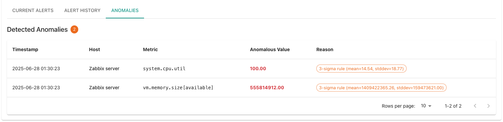

# Network Monitoring Application - User Guide

A comprehensive step-by-step guide to using the AI-powered network monitoring system with Zabbix integration.

## Table of Contents

1. [Prerequisites & Installation](#prerequisites--installation)
2. [Zabbix Host Configuration](#zabbix-host-configuration)
3. [Frontend Dashboard Overview](#frontend-dashboard-overview)
4. [Performance Metrics & Charts](#performance-metrics--charts)
5. [System Alerts & History](#system-alerts--history)
6. [AI Configuration](#ai-configuration)
7. [Email Notification Setup](#email-notification-setup)
8. [Backend API Documentation](#backend-api-documentation)
9. [Troubleshooting](#troubleshooting)

---

## Prerequisites & Installation

### System Requirements
- Docker and Docker Compose
- Modern web browser (Chrome, Firefox, Safari, Edge)
- Network access to monitored hosts

### Quick Setup
```bash
# Clone and start the application
git clone <repository-url>
cd network-monitoring
docker-compose -f deployment/docker-compose.yml up -d
```

### Access Points
- **Frontend Dashboard**: http://localhost
- **Zabbix Web Console**: http://localhost:8080
- **MailHog (Email Testing)**: http://localhost:8025

---

## Zabbix Host Configuration

### Step 1: Access Zabbix Web Console
1. Open your browser and navigate to `http://localhost:8080`
2. Login with default credentials:
   - **Username**: `Admin`
   - **Password**: `zabbix`


### Step 2: Add New Hosts
1. Navigate to **Configuration** → **Hosts**
2. Click **Create host** button
3. Fill in the host details:
   - **Host name**: Enter a descriptive name (e.g., `web-server-01`)
   - **Groups**: Select or create a host group
   - **Agent interfaces**: Add the host's IP address and port 10050


### Step 3: Configure Host Templates
1. In the **Templates** tab, link appropriate templates:
   - **Template OS Linux** (for Linux hosts)
   - **Template OS Windows** (for Windows hosts)
   - **Template Module Generic** (for generic monitoring)


### Step 4: Configure Items to Monitor
1. Go to **Configuration** → **Hosts** → Select your host
2. Click **Items** tab
3. Ensure these key metrics are configured:
   - `system.cpu.util` - CPU utilization
   - `vm.memory.size[available]` - Available memory
   - `vm.memory.size[total]` - Total memory
   - `net.if.in[eth0]` - Network input
   - `net.if.out[eth0]` - Network output


### Step 5: Set Up Triggers
1. In the **Triggers** tab, create alerts for:
   - High CPU usage (>80%)
   - Low memory availability (<10%)
   - Network interface down
   - Host unreachable


---

## Frontend Dashboard Overview

### Step 1: Access the Dashboard
1. Open your browser and navigate to `http://localhost`
2. The dashboard will load with the main monitoring interface


### Step 2: Host Selection
1. Use the **Select Host** dropdown in the top-left corner
2. Choose the host you want to monitor
3. The dashboard will update to show data for the selected host


### Step 3: Dashboard Sections
The dashboard is organized into several key sections:

1. **Host Status Table** - Shows all monitored hosts and their current status
2. **System Alerts** - Tabbed interface for current alerts, history, and anomalies
3. **Performance Metrics** - Interactive charts for CPU, memory, and network data

---

## Performance Metrics & Charts

### Step 1: Understanding the Charts
The Performance Metrics section provides three main chart types:
- **CPU Utilization** - Shows CPU usage over time
- **Memory Usage** - Displays available memory in GB
- **Network Traffic** - Shows inbound and outbound network data


### Step 2: Time Range Selection
1. Use the time range tabs above the charts:
   - **30m** - Last 30 minutes
   - **1h** - Last hour
   - **3h** - Last 3 hours
   - **6h** - Last 6 hours
   - **12h** - Last 12 hours
   - **24h** - Last 24 hours
   - **7d** - Last 7 days
   - **30d** - Last 30 days


### Step 3: Chart Navigation
1. **Switch between metrics**: Click on CPU, Memory, or Network tabs
2. **Hover for details**: Move your mouse over the chart to see exact values
3. **Zoom and pan**: Use chart controls for detailed analysis
4. **Export data**: Right-click on charts for export options

---

## System Alerts & History

### Step 1: Current Alerts Tab
1. Click on the **"Current Alerts"** tab in the System Alerts section
2. View all active alerts with:
   - **Severity level** (color-coded chips)
   - **Alert description**
   - **Affected host**
   - **Analyze button** for AI-powered analysis


### Step 2: Alert Analysis
1. Click the **"Analyze"** button next to any alert
2. Wait for the AI analysis to complete
3. Review the analysis results:
   - **Root cause analysis**
   - **Recommended actions**
   - **Impact assessment**


### Step 3: Alert History Tab
1. Click on the **"Alert History"** tab
2. Browse historical alerts with:
   - **Timestamps** of when alerts occurred
   - **AI analysis results** (if available)
   - **Resolution status**
3. Use the accordion interface to expand alert details


### Step 4: Anomalies Tab
1. Click on the **"Anomalies"** tab
2. View automatically detected anomalies:
   - **Statistical outliers** in metrics
   - **3-sigma rule violations**
   - **Timestamp and host information**
3. Use pagination to navigate through large lists


---

## AI Configuration

### Step 1: Access AI Settings
1. Click the **Settings icon** (⚙️) in the top-right corner of the dashboard
2. Click on the **"AI Configuration"** tab


### Step 2: Configure Google AI API
1. **Get API Key**:
   - Visit [Google AI Studio](https://aistudio.google.com/)
   - Create a new API key
   - Copy the key to your clipboard

2. **Enter API Key**:
   - Paste your API key in the **"Google AI API Key"** field
   - The field is password-protected for security

### Step 3: Select AI Model
Choose from available models:
- **Gemini 2.0 Flash (Fast)** - Recommended for real-time analysis
- **Gemini 1.5 Flash (Balanced)** - Good balance of speed and accuracy
- **Gemini 1.5 Pro (Advanced)** - Highest accuracy, slower response


### Step 4: Test AI Connection
1. Click the **"Test AI Connection"** button
2. Wait for the test to complete
3. Verify you see a success message
4. If the test fails, check your API key and internet connection

### Step 5: Save Configuration
1. Click **"Save"** to apply your AI settings
2. The configuration is applied immediately
3. You can now use AI analysis for alerts and anomalies

---

## Email Notification Setup

### Step 1: Access Email Settings
1. Click the **Settings icon** (⚙️) in the top-right corner
2. Click on the **"Email Notifications"** tab


### Step 2: Configure SMTP Settings

#### Option A: Using MailHog (Development/Testing)
- **SMTP Host**: `mailhog`
- **SMTP Port**: `1025`
- **Username**: (leave blank)
- **Password**: (leave blank)
- **Recipients**: Any email address (e.g., `test@example.com`)

#### Option B: Using Gmail SMTP (Production)
1. **Generate App Password**:
   - Go to Google Account → Security
   - Enable 2-Step Verification
   - Generate App Password (16 characters)

2. **Configure Settings**:
   - **SMTP Host**: `smtp.gmail.com`
   - **SMTP Port**: `587`
   - **Username**: Your full Gmail address
   - **Password**: Your 16-character app password
   - **Recipients**: Comma-separated email addresses

### Step 3: Test Email Configuration
1. Click **"Send Test Email"** button
2. Check for success message
3. If using MailHog, check http://localhost:8025 for the test email
4. If using Gmail, check your recipient's inbox


### Step 4: Save Configuration
1. Click **"Save"** to store your email settings
2. The system will now send email notifications for alerts

---

## Backend API Documentation

### Base URL
```
http://localhost:8000/api
```

### Authentication
Most endpoints use Zabbix authentication. The backend automatically handles authentication using configured credentials.

### Core Endpoints

#### Host Management
```http
GET /api/hosts/status
GET /api/hosts/metrics-keys
```

#### Metrics
```http
GET /api/metrics/{host_id}?hours={hours}
```

#### Alerts
```http
GET /api/alerts
GET /api/alerts/history?limit={limit}
GET /api/alerts/{alert_id}/analyze
```

#### Anomalies
```http
GET /api/anomalies
```

#### Configuration
```http
GET /api/config/ai
POST /api/config/ai
POST /api/config/ai/test
GET /api/config/email
POST /api/config/email
POST /api/config/email/test
```

### Example API Calls

#### Get Host Status
```bash
curl -X GET "http://localhost:8000/api/hosts/status"
```

#### Get Metrics for Last Hour
```bash
curl -X GET "http://localhost:8000/api/metrics/10084?hours=1"
```

#### Analyze Alert
```bash
curl -X GET "http://localhost:8000/api/alerts/24340/analyze"
```

#### Test AI Configuration
```bash
curl -X POST "http://localhost:8000/api/config/ai/test" \
  -H "Content-Type: application/json"
```

### Response Formats

#### Host Status Response
```json
[
  {
    "host_id": "10084",
    "name": "web-server-01",
    "status": "up",
    "last_check": "2024-01-15T10:30:00Z",
    "issues": []
  }
]
```

#### Metrics Response
```json
[
  {
    "timestamp": "2024-01-15T10:30:00Z",
    "host_id": "10084",
    "cpu_usage": 25.5,
    "memory_usage": 8589934592,
    "memory_total": 17179869184,
    "network_in": 1024.5,
    "network_out": 512.3
  }
]
```

---

## Troubleshooting

### Common Issues

#### 1. Frontend Not Loading
**Symptoms**: Dashboard shows loading spinner indefinitely
**Solutions**:
- Check if backend is running: `docker ps`
- Verify backend is accessible: `curl http://localhost:8000/api/health`
- Check browser console for errors

#### 2. No Data in Charts
**Symptoms**: Charts show "No metrics available"
**Solutions**:
- Verify Zabbix is collecting data for the host
- Check if the host has the required metrics configured
- Ensure the collector service is running

#### 3. AI Analysis Failing
**Symptoms**: "AI analyzer is not configured" error
**Solutions**:
- Configure AI API key in settings
- Test AI connection
- Check internet connectivity
- Verify API key is valid

#### 4. Email Notifications Not Working
**Symptoms**: Test emails not received
**Solutions**:
- Verify SMTP settings
- Check MailHog interface (http://localhost:8025)
- Test with different SMTP provider
- Check firewall settings

#### 5. Zabbix Connection Issues
**Symptoms**: "Failed to fetch hosts" error
**Solutions**:
- Verify Zabbix is running: `docker ps | grep zabbix`
- Check Zabbix web interface: http://localhost:8080
- Verify credentials in environment variables
- Check network connectivity

### Debug Commands

#### Check Service Status
```bash
docker ps
docker logs network-monitoring-backend
docker logs network-monitoring-frontend
```

#### Test Backend Health
```bash
curl http://localhost:8000/api/health
```

#### Check Database Connection
```bash
docker exec -it timescaledb psql -U zabbix -d metrics -c "SELECT COUNT(*) FROM metrics;"
```

#### View Zabbix Logs
```bash
docker logs zabbix-server
docker logs zabbix-web
```

### Performance Optimization

#### For Large Deployments
1. **Increase database resources** for TimescaleDB
2. **Adjust collection intervals** in collector configuration
3. **Implement data retention policies**
4. **Use load balancing** for multiple backend instances

#### Monitoring Best Practices
1. **Set appropriate thresholds** for your environment
2. **Use meaningful host names** and descriptions
3. **Regularly review and tune** alert rules
4. **Monitor the monitoring system** itself

---

## Support & Resources

### Documentation
- [Zabbix Documentation](https://www.zabbix.com/documentation)
- [TimescaleDB Documentation](https://docs.timescale.com/)
- [React Documentation](https://reactjs.org/docs/)
- [Backend API](http://localhost:8000/docs)

### Community
- [Zabbix Community Forum](https://www.zabbix.com/forum)
- [GitHub Issues](https://github.com/your-repo/issues)